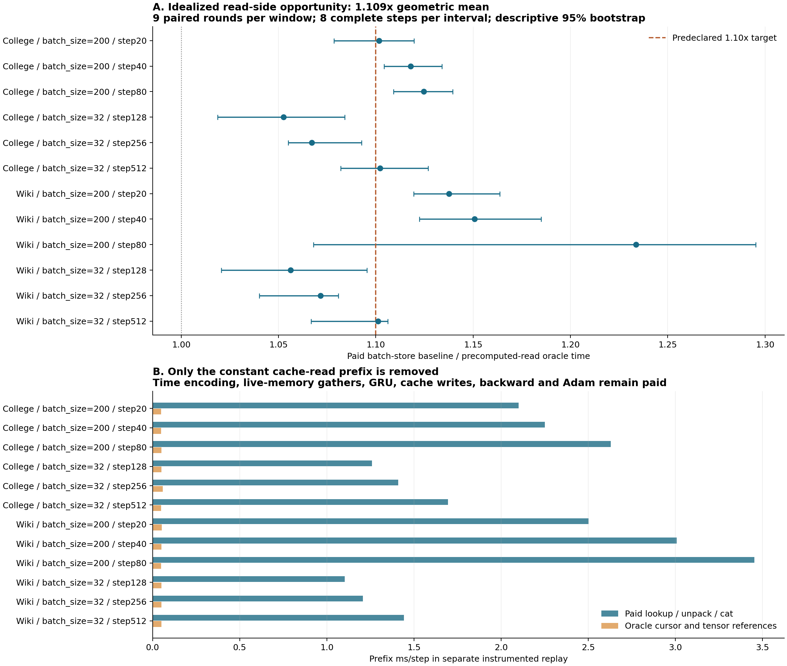

**缓存读取侧确实还有空间，但“整体再快 10%”仅擦边通过理想化对照，实际实现仍有风险。** 将查字典和拼接预先完成后，相对已优化的批量缓存基线，12 个窗口的配对比值几何平均为 **1.1087×**，对应整步耗时降低约 **9.81%**。这超过事前的 1.10× 点估计门槛，但本轮测到的是预缓存对照，尚不是可部署实现的收益。

本轮基线保留 direct-CSR 和上一轮批量消息写入，没有采用收益很小的 no-grad 改动。硬件仍是 **RTX PRO 6000 Blackwell Server Edition 的 GPU3**。下文 `batch_size=32/200` 表示训练批大小。

| 范围 | 理想化整步比值几何平均 | 各窗口配对中位数范围 |
|---|---:|---:|
| 全部 12 窗口 | **1.1087×** | 1.0526–1.2337× |
| batch_size=32，六个窗口 | **1.0749×** | 1.0526–1.1022× |
| batch_size=200，六个窗口 | **1.1436×** | 1.1016–1.2337× |

12/12 个窗口的描述性 95% 区间下界均高于 1，说明读取侧开销值得关注。但只有 **4/12** 的区间下界高于 1.10，另有四个窗口的区间上界低于 1.10。完整时间、逐窗口区间见 [计时表](analysis/table.md)。比值取九轮“同轮基线时间／对照时间”的中位数，不是两个独立耗时中位数的商。

事后增加的描述性总体 bootstrap 区间为 **[1.0972, 1.1166]**，仍跨过 1.10；逐一移除一个窗口的敏感性分析得到约 **1.0980–1.1140×**。这些附加分析不改变事前点估计门槛，也不能充当跨会话统计保证。最大的单窗口点估计来自 Wikipedia、batch_size=200、step80，但它的区间很宽，约 **[1.068, 1.295]**；不能单挑 1.234× 当作稳定收益。

因此，按事前规则，本方向可以进入**一次低成本的真实读取原型验证**，还不足以支持直接投入复杂的新布局或内核开发。若以总体点估计作粗略预算，理想对照省下约 9.81% 的基线时间，而 1.10× 需要省下 9.09%；真实实现需保留约 **93% 的理想节省量**，留给实际读取和维护的空间很窄。这个换算只是对几何平均比值的工程预算提示，不是严格上界证明。batch_size=200 的余量相对较大，可以优先观察，但后续仍应报告全部固定窗口。

对照的范围严格限于 `_compute_msg` 开头的读取步骤：节点 ID 转主机列表、查消息字典、解包、四个字段的 `cat`。在真实基线执行时，记录其已经拼好的 `src`、`dst`、`t`、`raw_msg`，随后对照直接使用常驻 GPU 的记录。四个字段都不需要梯度；每步四次调用分别对应 Memory 读取和状态推进的源／目的方向。

**没有预计算带学习参数的结果。** 时间差仍用当前 `last_update` 计算，时间编码每步重新执行，当前 `memory` 仍被实时索引，消息组合、LastAggregator、GRU、状态写回、正常批量缓存写入、邻居更新、Decoder、Backward 和 Adam 均照常付费。两个逻辑消息字典仍通过真实更新维持，不是跳过写入后再补回最终状态。

独立的分阶段回放验证了工作范围：基线每步有四次查找、四次解包和 **16 次字段拼接**；对照中这些调用归零，替换为四次缓存记录读取。对应前缀阶段平均从约 **2.005 ms/步降至 0.05 ms/步**。这是单独 CUDA-event 插桩回放，包含提交间隙和插桩开销，不能直接替代无详细插桩的整步计时。

正确性和记录来源都经过检查：

- 采集路径、正常批量缓存基线、预缓存读取对照，各自 **96/96 步**与上一轮 direct 的 **119 个字段逐字节一致**；每种比较 214,887,202 个元素。原有 107 字段也各自 96/96 与 source 归档一致。
- CPU/NumPy 从初始 checkpoint 的真实节点消息字典、以及随后每步的归档逻辑缓存，按实际选中节点顺序重新拼接，独立重建 **384 次读取、10,610,895 个字段元素**，全部精确一致。
- 资格检查中的每次预缓存调用还核对实际 `n_id` 和源／目的方向；每个计时步骤检查四次调用的计数。
- 24 个详细回放末状态通过 115 个持久字段的逐字节复核。正常缓存与对照的逻辑缓存字节、底层 storage 字节和存储数量在全部 96 个观察点上一致。

完整审计见 [audit.json](evidence/qualify_v2/audit.json)。119 字段覆盖参数、梯度、Adam、memory、时间戳、有效邻居、输出／loss／embedding／dx、逻辑消息缓存以及 CPU/CUDA RNG。

计时共 **216 个区间、1728 个完整训练步骤**，每窗口九轮随机配对、每区间连续八步。checkpoint／RNG 恢复、GC、预热、记录采集和加载在计时之外；两种实现同时保留相同的记录 Tensor，以对齐常驻分配。对照仍付游标推进、记录引用以及所有其余训练成本。所有数值和 CPU 重建审计完成后才启动计时，没有把审核传输放入计时区间。

12 个窗口一共保存约 **44.79 MB** 的记录 Tensor 数据；一次只加载一个窗口，最大常驻底层 storage 为 **14.57 MB**，包括核验用的节点 ID。这个额外存储属于实验对照，不能当作已设计好的生产缓存容量。重复使用 Tensor 会改变分配生命周期和缓存行为，因此本结果是理想化机会测量，**不是数学上严格的性能上界**。

首次 `qualify_v1` 因新模块名与旧依赖冲突，在进入训练前退出。重命名实验模块后，`qualify_v2` 完成全部检查；原失败日志及原文件版本保留在 [ATTEMPTS.md](ATTEMPTS.md) 所列位置。计算范围、数值门槛和收益门槛均未修改，没有放宽精度或替换失败的数值样本。

下一次若继续，建议只做一个小而完整的付费原型：以事件索引组织节点的待处理消息，从原始消息数组批量读取，减少 Python 字典和大量小 Tensor 拼接；同时计入索引维护、动态长度处理、GPU 同步及存储成本。它必须经过同一套状态验收和整步计时。当前实验既没有证明这个原型能够达到 1.10×，也没有解决旧批量缓存的长期视图保留问题。

源码、命令与原始产物索引见 [REPRODUCE.md](REPRODUCE.md)。所有实验仍限于 12 个固定历史 checkpoint 的八步窗口，历史来自 keeper；没有全 epoch 质量、长训练占用上界、原版 TGN 完整入口或 Tensor Core 收益结论。原项目和此前实验保持只读。
