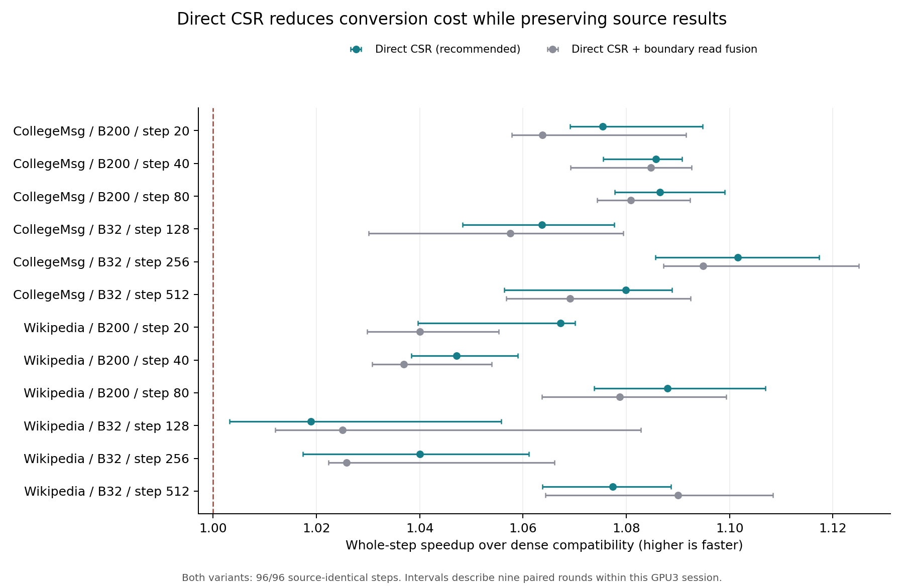

**直接 CSR 已替代稠密往返转换，并保持全部 96 个训练步的原版一致性。** 相对上一轮通过数值验收的稠密兼容路径，12 个窗口的配对加速比中位数为 **1.019–1.102×**，窗口比值的几何平均为 **1.069×**，对应耗时降低约 **6.46%**。推荐采用 `direct` 路径。

通俗地说，原先要把一份紧凑的非零元素清单展开成大表，再扫描大表生成另一份清单。这次直接整理已有清单，同时保留原来的浮点聚合和反向计算顺序。因此既省下了搬运和扫描工作，也没有重现前一轮的训练漂移。

| 配置，每项三个窗口 | 新路径整步耗时中位数 | 相对稠密兼容路径的加速比 |
|---|---:|---:|
| Wikipedia，B32 | 18.46–18.86 ms | 1.019–1.077× |
| Wikipedia，B200 | 24.54–26.21 ms | 1.047–1.088× |
| CollegeMsg，B32 | 18.57–18.93 ms | 1.064–1.102× |
| CollegeMsg，B200 | 28.01–30.44 ms | 1.075–1.087× |

每个窗口恢复相同 checkpoint 和随机状态，连续执行八个真实训练步；九轮随机顺序配对比较四个版本，共 432 个计时区间、3,456 个计时训练步。数据和模型预先驻留 GPU，计时包含本步建图、整数生产、分配、主机同步、格式转换、memory、GNN、解码器、反向和 Adam；恢复 checkpoint 与显式垃圾回收在计时外。

本轮使用同型号的 GPU3，四个版本都在这张卡上重新计时。GPU2 已被其他工作占用，没有使用它。结果不与此前 GPU2 的绝对耗时混算。九轮配对样本的描述性 bootstrap 95% 区间在 12 个窗口内均高于 1，但这些区间只描述本次共享主机上的样本，不构成跨时段、跨机器保证。完整数据见 [配对计时表](analysis/table.md)和[原始比值与区间](analysis/summary.json)。

**实现只改变系数格式的交接。** [bridge.py](src/bridge.py) 直接按通道与查询顺序拼接原有 CSR 列索引、数值和行指针，不再创建 `7×B×N` 的稠密 C，也不再对该稠密张量调用 `nonzero`。新增转换的工作量随非零数和行数增长。原有普通 GPU 整数生产器保持使用，正负查询继续共享建图；原版十四次 `torch_sparse.spmm_add`、正负查询端点乘积和自动求导组织保持原样。没有修改模型精度或新增 CUDA kernel。

本轮同时验证了两个版本：

| 版本 | 改动 | 对稠密兼容路径的几何平均加速比 | 处理结果 |
|---|---|---:|---|
| `direct` | 保留原生产器；额外一次批量读取通道边界，直接拼接 CSR | 1.069× | 推荐路径 |
| `fused_bounds` | 将边界读取合并到原有 NNZ／精确分配同步 | 1.062× | 保留为对照，没有额外速度收益 |

`direct/fused_bounds` 的配对中位比值几何平均为 0.996，两个版本的差距很小。减少一次边界读取并没有自动转化为整步收益；第二个版本在整数生产阶段增加了读取多个偏移的工作。因此采用保持原生产器的简单版本，不按窗口挑选不同实现。计时后只把默认参数改为 `direct`，两条计算分支都没有改动；[bridge_v1.py](src/bridge_v1.py) 保存 GPU 日志中记录的原始源码版本。

**一致性与结构检查均通过。** 两个新版本各自在 12 个窗口、96 个步骤上，与归档原版的所有已检查字段逐字节相同。原有 `atol=rtol=2e-4` 对照也全部通过。检查覆盖参数、梯度、Adam 状态、memory、last_update、有效邻居、embedding、dX、logits 和 loss，每步 107 个字段。

| 路径 | 已检查字段逐字节相同步数 | 原有容差通过步数 |
|---|---:|---:|
| 上一轮稠密兼容路径，重新在 GPU3 运行 | 96/96 | 96/96 |
| 直接 CSR | 96/96 | 96/96 |
| 合并边界读取 | 96/96 | 96/96 |
| 旧 keeper，诊断对照 | 0/96 | 86/96 |

新版本的 384 次正／负预测调用，还逐项核对了 CSR 行指针、列索引和数值与稠密转换的结果。独立 CPU/NumPy 审核从实际保存的输入 CSR 分块重建整数 C，再与输出 CSR 比较；共覆盖 192,307,584 个矩阵位置，并检查行指针合法、行内列索引严格有序、没有存储零值。每个版本的训练张量比较量为 187,803,430 个元素；这些是重复字段的比较量，不是独立统计试验。见 [CPU 审核结果](evidence/qualify_v1/audit.json)。

**仍有一部分性能差距。** 新推荐路径与同场次旧 keeper 相比，耗时几何平均仍多约 **11.2%**。旧 keeper 的十个容差失败步骤也在 GPU3 复现，所以不能用它直接替代合格的完整训练路径。

独立插桩回放中，格式转换项的窗口均值从约 2.97 ms/步降到 0.92 ms/步。但直接 CSR 把行索引生成推迟到 SpMM，合并边界版又把部分工作移到整数生产阶段；旧路径的插桩点也更多。这些分项只用于定位，整步收益以上述无额外插桩的配对计时为准。

下一轮应以 `direct` 为数值参照，细分 memory 和反向，以及保留原版浮点顺序所需的消费者开销，再决定下一项优化。当前没有证据把剩余差距全部算作格式转换成本。

本轮延续固定版本 TNCN mode 2、无时间衰减、D100、两份 20k 事件前缀、B32/B200 和既有真实训练 checkpoint。它证明这些共同起点下的窗口级一致性与普通实现收益；尚未覆盖完整 epoch、任务质量或原版 TGN 入口，也不构成 Tensor Core 贡献。每步没有额外逐字节比较消息字典与随机状态，二者从起始 checkpoint 恢复并参与后续训练。

复现入口、环境与证据位置见 [REPRODUCE.md](REPRODUCE.md)。72 份实际张量归档共 3,078,168,200 字节留在远端，本地提供日志、独立审核、源码、图表和哈希清单。旧项目及前两轮证据保持原样。

收尾核验：23 份非张量证据与本地文件哈希一致，旧归档及运行时源码的 1,276 个文件保持原哈希。GPU3 的实验进程及互斥锁已释放，未改动 GPU1、GPU2 上的其他任务。见 [远端清单](remote_manifest.json)及[传输核验](transfer_verification.json)。
