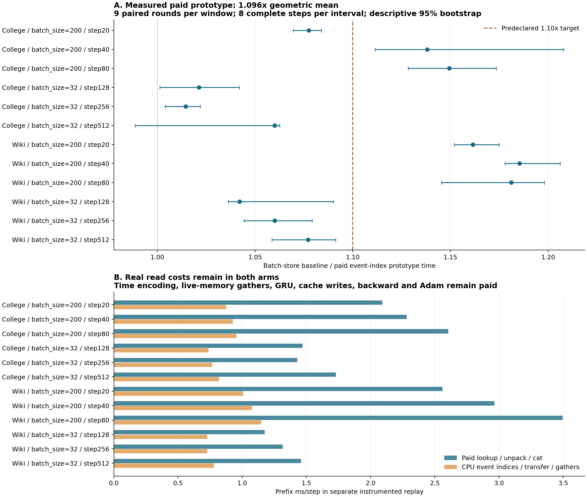

**事件索引缓存原型有实际收益：整体 1.0957×，步耗时约下降 8.74%；batch_size=200 的收益更大。整体仍略低于预先约定的 1.10× 目标，描述性区间 [1.0905, 1.1019] 跨过该目标。**

实验日期：2026-09-09。基线为已通过数值核验的 direct-CSR + 批量缓存写入，原型为 `event_index`。索引维护、动态长度处理、CPU/GPU 传输、读取与写入都计入实测整步；初始化 CPU 输入副本和历史 checkpoint 导入单独披露。此次未加入 no-grad 或 Tensor Core 改动。

| 范围 | 实测整步加速比 | 对应步耗时下降 |
|---|---:|---:|
| 全部 12 个窗口 | 1.0957× | 8.74% |
| batch_size=32，6 个窗口 | 1.0456× | 4.36% |
| batch_size=200，6 个窗口 | 1.1483× | 12.91% |

这些比值是每个窗口九轮配对比值的中位数，再跨窗口取几何平均，不能把各方案独立中位耗时相除来代替。墙钟口径为 1.0957×，与 CUDA 时间线口径一致。12 个窗口的点估计均大于 1；11 个窗口的描述性 95% 区间下界大于 1，CollegeMsg / batch_size=32 / step512 的区间包含 1。batch_size=200 的六个窗口中，五个区间下界大于 1.10；另一个仅约 1.077×。不据此宣称所有窗口都达到 10% 加速。

| 窗口 | 批量缓存基线 ms/步 | 事件索引原型 ms/步 | 配对比值 | 95% CI |
|---|---:|---:|---:|---:|
| college / batch_size=200 / step20 | 17.872 | 16.553 | 1.077 | [1.069, 1.084] |
| college / batch_size=200 / step40 | 24.238 | 21.407 | 1.138 | [1.111, 1.208] |
| college / batch_size=200 / step80 | 24.836 | 21.605 | 1.149 | [1.128, 1.173] |
| college / batch_size=32 / step128 | 18.041 | 17.718 | 1.021 | [1.001, 1.042] |
| college / batch_size=32 / step256 | 17.953 | 17.669 | 1.015 | [1.004, 1.022] |
| college / batch_size=32 / step512 | 15.929 | 15.017 | 1.060 | [0.989, 1.063] |
| wikipedia / batch_size=200 / step20 | 21.386 | 18.347 | 1.161 | [1.152, 1.175] |
| wikipedia / batch_size=200 / step40 | 21.720 | 18.295 | 1.185 | [1.178, 1.206] |
| wikipedia / batch_size=200 / step80 | 22.179 | 18.897 | 1.181 | [1.145, 1.198] |
| wikipedia / batch_size=32 / step128 | 17.585 | 16.593 | 1.042 | [1.036, 1.090] |
| wikipedia / batch_size=32 / step256 | 17.936 | 16.920 | 1.060 | [1.044, 1.079] |
| wikipedia / batch_size=32 / step512 | 18.395 | 17.055 | 1.077 | [1.059, 1.091] |

原型把每个节点的四组待处理消息张量换成 CPU 上的事件编号切片。每次读取仍然从实际选中的节点出发，将编号拼接、传到 GPU，再从训练本来就持有的原始数据取出 src、dst、时间和消息特征。每次写入仍执行原版 GPU 排序，保留相同键的实际排序顺序；随后支付排列索引回传、CPU 分组和节点索引替换。训练中的时间差、可训练时间编码、当前 memory 读取、聚合、GRU、GNN、Decoder、反向与 Adam 均继续执行。

单独的事件计时解释了工作量变化：

| 诊断范围，12 个窗口均值 | 批量缓存基线 ms/步 | 事件索引原型 ms/步 |
|---|---:|---:|
| 四次常量消息读取前缀 | 2.048 | 0.879 |
| 两次消息缓存写入合计 | 0.889 | 0.328 |

基线每步执行 4 次节点查询、4 次字段解包和 16 次 cat。原型执行 4 次 CPU 编号查询／拼接、4 次编号传输、4 组字段 gather，每组 4 个字段。原型同时减少了写入侧开销，因此整体收益不能全算在“消除读取拼接”上。这些阶段计时含 CPU 提交间隙和埋点成本，只作机制证据；整步结果来自另一次没有细分埋点的测量。其他阶段的计时波动不能当成未修改算子的算法提速。

本次 GPU3 上的真实付费原型与上次预缓存读取对照来自不同会话，且原型同时改变了写入。不能用本次 1.096× 与上次 1.109× 相除来推断“实现了多少上限”，也不能把历次加速比相乘后声称总收益。

**正确性检查全部通过。** `qualify_v1` 中两条路径分别完成 12 个窗口、每窗口 8 个连续步骤，共 96 步，各自比较 214,887,202 个元素；119 个扩展字段全部逐字节等于此前 direct 档案，原版 107 个字段也全部逐字节等于 source。范围覆盖 logits、loss、embedding、输入与参数梯度、参数、Adam、memory、last_update、邻居状态、逻辑消息缓存及 CPU/CUDA RNG。

独立 CPU/NumPy 审计在性能计时之前完成。它重新核对全部训练档案，并完成两种相互补充的核验：384 次实际 GPU 读取的结果与历史 checkpoint／上一步 direct 逻辑缓存重建结果一致，共 10,610,895 个字段元素；同样 384 次读取还与原始数据按记录的事件编号取值一致，且所有编号早于正在执行的批次。导入历史缓存时，若多个过去事件的四个字段完全相同，选择最早匹配项作为表示编号；这不会推断或替换独立邻居缓存中的真实事件身份。后续写入使用实际当前事件编号。

`profiles_v1` 的 24 段八步回放结束后，115 个持久字段也全部逐字节一致。三次 GPU 运行均首轮正常完成，没有数值失败、调宽容差或看完性能后改候选实现。原始检查张量与实际读取记录共 36 个文件、1,799,239,652 字节，保留在远端并记录 SHA-256。

**空间和初始化有明确代价。** 本轮 96 个观察点中，原型的逻辑消息内容与基线相同，活跃 CPU 事件编号占 7,552–40,664 字节；连同未被切片使用、但仍被引用的底层编号数组，共保留 8,064–63,688 字节。原型额外持有完整 CPU 输入副本：Wikipedia 14,240,000 字节，CollegeMsg 560,000 字节。GPU 原始输入表在基线中已存在，不是新增的预计算读取表。

资格检查中，CPU 输入复制段墙时为 Wikipedia 10.35–10.91 ms、CollegeMsg 0.26–0.30 ms；历史索引导入为 16.96–34.88 ms、8.60–22.51 ms。这些只在初始化／导入发生，未计入稳态八步间隔，可能包含等待此前排队初始化工作的时间。完整模型初始化和 checkpoint 恢复也未计入两边的稳态时间，不能把稳态比值解释为包含所有启动成本的全流程比值。

编号切片还可能保留所属批次的未使用部分；冻结 checkpoint 的种子编号也作为回放工具的恢复数据保留。上述编号统计不含这部分独立恢复数据、Python 对象、分配器或整进程峰值。原型移除了活跃消息存储中的 GPU 原始特征副本，但没有在本轮实测完整 epoch 的显存峰值或长期内存上界。

测量运行于 pro6000-8 的 NVIDIA RTX PRO 6000 Blackwell Server Edition GPU3；batch_size=200 不是 B200 型号。使用同一块卡的九轮随机配对、每段八个完整训练步骤，共 216 段、1728 个计时步骤。GPU3 独占检查通过；服务器其他 GPU 当时有任务，未隔离整机 CPU／内存带宽。20,000 次 bootstrap 仅描述本次共享主机会话中的变化，不能覆盖跨主机负载或跨会话的全部不确定性。

当前实现限于这条“原始事件表固定、顺序处理批次”的训练适配器。它尚未完成训练／验证模式切换、通用保存／恢复接口、任意生成消息输入或从初始化开始的完整训练质量验收。历史窗口仍从旧 keeper 产生的 checkpoint 开始；本次逐字节通过不改变该范围。

**建议保留这个小原型，下一步优先验证连续训练和缓存生命周期，重点观察 batch_size=200。** 它已经提供可测的普通缓存优化收益，但未通过整体 1.10× 的点估计门槛，不继续为凑齐这一数字微调本轮实现，也不把它升级为 Tensor Core 核心贡献或默认生产路径。

固定合同见 [CONTRACT.md](CONTRACT.md)，实现和重跑步骤见 [REPRODUCE.md](REPRODUCE.md)，全部配对数据、阶段耗时和存储观察见 [analysis/summary.json](analysis/summary.json)。运行记录位于 `evidence/qualify_v1`、`evidence/timing_v1`、`evidence/profiles_v1`；本地／远端清单与传输核验随实验保存。
