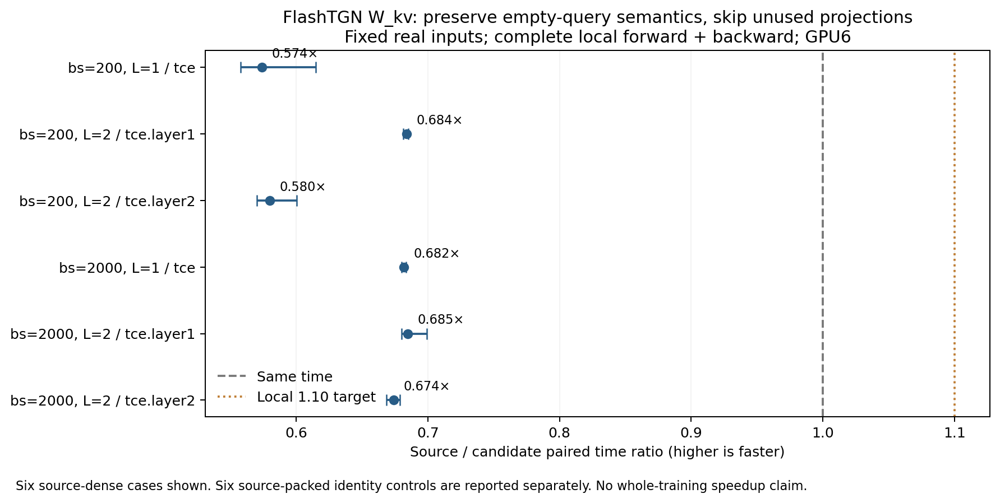

**小实验已完成：保留空查询语义后，局部数值验证通过；六组实际改变的 dense 输入，配对局部速度几何平均为 0.644×。这个具体实现全部变慢，没有达到预先设定的 1.10× 兴趣门槛，应停止扩大这条实现的实验。**

六组 dense 输入的局部耗时几何平均增加约 55.2%，各组配对区间上沿均低于 1。未改变的 packed 对照接近 1×。因此本次结论是：数值边界可以保住，但“压缩投影后再展开成 dense”的全部新增代价超过节省的计算。不能把减少 24%–31% 投影行数当成加速。

本次 baseline 始终是已有 FlashTGN。测试范围是 K=50、batch_size=200/2000、一层/两层，共四种配置；每种捕获早期和中部两个真实训练步骤的所有 attention 层，得到 12 组输入。使用原始 Wikipedia 数据、源模型权重、memory、邻居和实际 loss 上游梯度，没有编造输入或缩减矩阵行数。捕获过程跑四个完整源训练 epoch，仅用于得到真实输入；其序列化耗时不算性能结果。

源码、原编译扩展、数据和此前隔离依赖保持不变，并复核了先前固定的 809 个源输入文件。捕获及独立反向核重复实验使用 GPU0；修正版资格检查和全部配对计时统一使用 GPU6，均为 RTX PRO 6000 Blackwell Server Edition。中途 GPU0 被其他任务占用，防冲突检查在计算前退出；未干预其他任务，也未计算跨设备速度比。其他 GPU 有并行任务，CPU/内存并非完全专用。

**先把源实现自身的噪声单独测出来。**

捕获实际 `fused_gather_encode_backward_v2` 和 `fused_l0_gather_encode_backward_v2` 的完整输入，逐组固定，分别重复 16 次，共 192 次调用。每次保存完整输出，并在结束后检查输入没有变化。0/192 与捕获时的输出逐字节相同，但 **192/192 都满足原先固定的 `abs(a-b) <= 2e-4 + 2e-4*abs(reference)`**。最大误差与其对应容差之比为 0.332，未改精度或放宽门槛；独立 CPU/NumPy 审计确认了所有统计。

这证明这两个融合反向核存在浮点非确定性，同时表明此次固定输入下的差异仍在旧门槛内。它不是所有输入的噪声上界，也没有解释或解决之前连续训练的全部漂移。原先完整训练 gate 仍然失败。不能把候选引入的任何差异都笼统归为源噪声。

**第一版并不正确：无效邻居不总是无用位置。**

早期输入只有约 17%–42% 的有效邻居，源码已自动走 packed 路径；这一分支没有改变。中部输入有效邻居约 55%–67%，源码会走 dense 路径，对全部位置执行 `W_kv`。

第一版只投影有效位置，再把投影结果填回全尺寸缓冲区，仍调用原 dense attention。六组改变的输入全部未通过验证。独立 CPU 检查发现，**所有越界的输出行都属于完全没有邻居的查询**，非空查询没有越界；输出最大差异约 0.038–0.040，部分 bias 梯度也越界。与此同时，12 组原版自重放和捕获输出对照全部逐字节相同。因此这个失败是候选的语义变化，不能用反向核的随机舍入解释。

原因在当前 FlashTGN 的 dense 内核：无效位置的 score 设为 -1e9；一整行都无效时，softmax 会得到均匀权重，输出仍消费这些填充位置的投影值。它的 segmented 内核对空 segment 返回零，行为不同。本实验保留源码实际选择的分支及其行为，没有擅自统一或修复 attention 语义。

**修正版只省去确定未被消费的投影。**

只对“有有效邻居的查询”跳过其中无效的位置；对完全空的查询，保留原来全部 K 个位置的投影。源码 packed 分支、attention 内核及其前后向顺序不变。实现仅替换 dense 分支的一条 `W_kv(z_flat)` 语句，AST 复原检查确认其余源码一致。没有新 CUDA 核、缓存索引、低精度替代或省略梯度。

修正后实际可跳过的投影行为 **24.3%–31.4%**，少于第一版误以为可省的 33%–45%。修正版 12/12 通过完整局部检查，共检查 3,162,063,416 个输出/梯度元素。12 组输出、q_proj 梯度、z_flat 梯度都与原版逐字节一致。六组 packed 对照的全部字段也逐字节相同；六组 dense 输入仅 W_kv 权重与 bias 梯度有归约舍入差异，最大绝对误差 2.53e-07，最大占对应容差 0.125%。独立 CPU 审计对三类比较共 36/36 全部确认通过。

这一结论严格限定于固定输入下的局部输出和梯度；没有更新 Adam 后再验收连续训练，也没有用它替代全模型、时间编码后续步骤或 AP/AUC 的验证。

**性能计入了所有新增代价。**

每组输入做 9 轮随机顺序配对，每个区间执行 5 次完整局部 forward+backward，另有每臂 4 次预热；共 216 个区间、1,080 次计时调用。计入 mask/reduction、动态筛选同步、有效行复制、投影、全尺寸缓冲区清零与 scatter，以及所有输入和参数梯度的计算、分配和回写。输入载入在计时外，两臂使用相同驻留输入、权重及真实上游梯度。实际 attention 源码路径计数和扩展调用计数包装在两臂中同样付费，没有详细 profiler 或额外内部事件。

|汇总范围|输入数|局部配对比值几何平均|描述性 95% 区间|
|---|---:|---:|---|
|实际改变的 source-dense 输入|6|0.644×|[0.641, 0.654]|
|未改变的 source-packed 对照|6|1.006×|[0.990, 1.019]|
|全部输入|12|0.805×|[0.799, 0.813]|

|batch_size|层数|位置/attention 层|源路径|投影保留行比例|源毫秒|候选毫秒|配对比值 [95%区间]|
|---:|---:|---|---|---:|---:|---:|---|
|200|1|early/tce|packed|17.5%|1.418|1.450|0.991 [0.937, 1.055]|
|200|1|middle/tce|dense|75.1%|1.058|1.830|0.574 [0.558, 0.615]|
|200|2|early/tce.layer1|packed|18.4%|1.543|1.513|1.011 [0.989, 1.066]|
|200|2|early/tce.layer2|packed|17.4%|1.284|1.264|1.040 [0.941, 1.072]|
|200|2|middle/tce.layer1|dense|71.7%|7.510|10.977|0.684 [0.681, 0.685]|
|200|2|middle/tce.layer2|dense|75.6%|0.982|1.689|0.580 [0.570, 0.600]|
|2000|1|early/tce|packed|38.5%|4.940|4.944|0.999 [0.999, 1.002]|
|2000|1|middle/tce|dense|72.2%|7.040|10.318|0.682 [0.680, 0.683]|
|2000|2|early/tce.layer1|packed|42.1%|16.574|16.589|1.000 [0.998, 1.005]|
|2000|2|early/tce.layer2|packed|38.5%|5.021|5.043|0.998 [0.992, 1.003]|
|2000|2|middle/tce.layer1|dense|68.6%|39.092|57.213|0.685 [0.680, 0.699]|
|2000|2|middle/tce.layer2|dense|73.0%|7.097|10.527|0.674 [0.669, 0.679]|

比值大于 1 表示候选更快。每行是配对比值的中位数，不能要求它等于表中两个独立耗时中位数之比。source-dense 子集在计时前按原始源码策略固定；没有挑掉失败或变慢的输入。区间来自这次固定输入的配对重采样，汇总区间是描述性分析，不代表跨会话、其他数据集或完整训练的保证。

这次验证说明，应同时检查被跳过的数据是否真的无用，以及省下的矩阵计算能否覆盖新增搬运。即使局部速度有提高，也不能把它直接乘以前次的整轮 backward 占比来宣称端到端收益：这里只测 `W_kv + attention` 及其局部反向，未计整个模型的采样、memory 更新、其他投影、optimizer 等，并且输入和上游梯度固定复用。

应停止扩大这个具体实现；没有必要先付出完整训练测试成本去追逐一个已明显变慢的局部原型。W_kv 仍是已观察到的开销，但新的尝试必须提出避免这次压缩与重新展开代价的具体办法，并先处理源训练数值对照的未决问题。第一版失败与原先完整训练 gate 失败均保留；本次没有建立完整训练加速或质量等价结论。

复核材料：[合同](CONTRACT.md)、[语义修订](AMENDMENT_1.md)、[设备修订](AMENDMENT_2.md)、[全部尝试](ATTEMPTS.md)、[复现说明](REPRODUCE.md)、[完整统计](analysis/summary.json)、[初版 CPU 审计](evidence/qualify_v1/audit.json)、[修正版 CPU 审计](evidence/qualify_keep_empty_v2/audit.json)、[反向噪声 CPU 审计](evidence/noise_v2/audit.json)。全部原始张量留在远程实验目录，输入/审计哈希、remote_manifest.json、transfer_verification.json 和 MANIFEST.sha256 明确保留范围。
