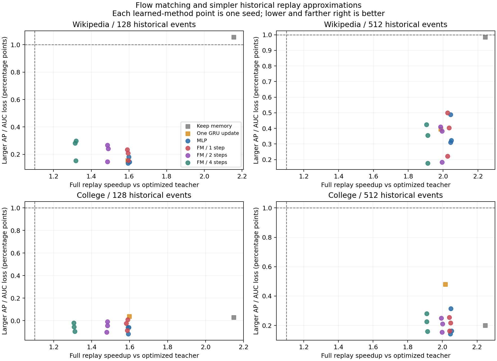
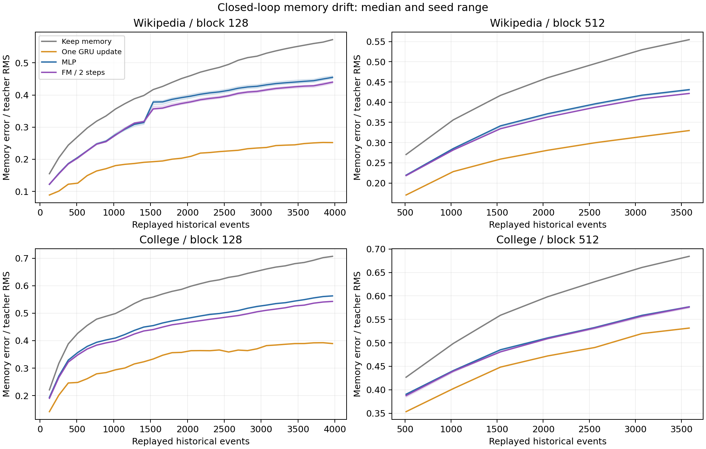

**实验支持用近似状态跳转加速历史回放，但目前没有显示 flow matching 比简单方法更值得使用。** 两步条件 FM 在本次测试中把历史回放加速到 **1.48–2.00×**；同输入、同参数量的 MLP 达到 **1.59–2.05×**，只做一次教师 GRU 更新也达到 **1.59–2.02×**。这些收益来自减少历史中的状态重算，不能当作完整 TGN/TNCN 训练加速。

本轮使用 Wikipedia 和 CollegeMsg 各 20000 个按时间排序的事件。前 12000 个训练教师和学生，随后 4000 个用于选模型，最后 4000 个测试。分别训练了一个五轮的 TNCN mode-2 教师，以验证 AP 选择权重，再固定权重、从零回放生成状态监督。固定教师在完整测试段上的 AP 分别为 **0.97145 / 0.92705**，AUC 为 **0.96367 / 0.90739**。这些是当前 20k 归档及负采样规则下的结果，不是全数据集官方基准。

教师以 32 个事件为一批更新状态。候选一次处理 128 或 512 个已发生事件，替代原来的 4 或 16 次状态重算。MLP 直接预测 memory 增量；条件 FM 学习增量的向量场，执行 1、2 或 4 个 Euler 步。每类学生使用三个随机种子、1500 次 Adam 更新、相同训练行、相同网络参数量；各自只按验证集选择 checkpoint。FM 的主检查点按两步推理的验证误差选择。

这是针对配对状态的确定性条件 FM 改造：`z₀=0`，`z₁=(结束 memory−起始 memory)/训练集尺度`，训练时使用 `zₛ=s·z₁` 和目标速度 `z₁`。条件包含起始 memory、四个时间顺序分组的事件特征、起始时刻的对端 memory、时间和方向信息。它没有采用高斯噪声生成、reflow 或额外一步蒸馏。四组平均是有损编码，因此本轮结论只针对这个具体方案。[FM 原论文](https://arxiv.org/abs/2210.02747)、[配对确定性映射的相关研究](https://papers.neurips.cc/paper_files/paper/2024/file/6eee1da520ac78c56f3a3e0353a5da34-Paper-Conference.pdf)

下面的速度是各随机种子配对加速比中位数的中位数；每个种子有七轮同卡计时。GRU 对照没有学生训练随机性。完整逐种子结果及不确定性区间见 [summary.json](analysis/summary.json) 和 [60 条路径表](analysis/table.md)。

| 数据／每块事件数 | 一次 GRU 更新 | MLP | 一步 FM | 两步 FM | 四步 FM |
|---|---:|---:|---:|---:|---:|
| Wikipedia／128 | 1.594× | 1.599× | 1.595× | 1.485× | 1.318× |
| Wikipedia／512 | 1.987× | 2.043× | 2.026× | 1.993× | 1.911× |
| CollegeMsg／128 | 1.599× | 1.593× | 1.587× | 1.483× | 1.307× |
| CollegeMsg／512 | 2.017× | 2.049× | 2.041× | 1.998× | 1.910× |

**计时包含整段历史回放的实际工作。** 所有路径都保留每个原始 32 事件批次的消息缓存写入和邻居插入；候选还支付特征编码、归一化、所有网络调用／Euler 更新以及状态写回。没有把输入编码提前算好，也没有从教师读取结束 memory。基线已经使用此前验证过的批量消息写入。计时共执行 **420 个完整回放区间**，每次结束的 memory 都与该路径的质量检查归档一致。

计时不包含边界查询的 GNN／Decoder、反向、Adam、加载 checkpoint 和学生准备过程。128／512 配置分别回放测试后缀中的 3968／3584 个事件，余下 32／416 个事件不计入回放区间。不能把这里的约两倍加速套到完整训练步，也没有检验逐事件都必须输出预测的在线任务。

**预测质量变化较小，但没有证明状态预测接近原版。** 每块回放后，用随后尚未发生的 32 个事件做查询；查询不改变状态。候选连续使用自己的 memory，不在块间对齐教师。128／512 配置分别有 31／7 个查询块，992／224 个正事件及等量固定负样本；不同块大小的查询集合不同。

| 数据／块大小 | 两步 FM 的 AP 变化，百分点，三个种子范围 | AUC 变化，百分点，三个种子范围 |
|---|---:|---:|
| Wikipedia／128 | −0.201 至 −0.086 | −0.267 至 −0.147 |
| Wikipedia／512 | −0.214 至 −0.163 | −0.411 至 −0.183 |
| CollegeMsg／128 | +0.016 至 +0.102 | +0.008 至 +0.147 |
| CollegeMsg／512 | −0.250 至 −0.155 | −0.249 至 −0.048 |

预设筛选线是回放至少 1.10×，AP 和 AUC 各下降不超过 1 个百分点。两步 FM 的 **12/12 个点估计**通过；MLP 也全部通过，一次 GRU 的四个配置全部通过。但按块重采样的描述性 95% 区间中，Wikipedia／512 的 FM 种子 1701 和 1702，AUC 变化下界分别约为 **−1.10／−1.25 个百分点**，仍越过筛选线。块之间存在时间相关性，只有一个测试后缀；这些区间不能作为长期质量保证。细小的正向变化也不能当作泛化提升。

两步 FM 在末尾的 memory 归一化 RMSE 为 **0.421–0.578**，分母是所有已观察节点的教师 memory RMS；这是明显的状态变化。一次 GRU 的对应误差为 **0.252–0.532**。更值得注意的是，CollegeMsg／128 连 memory 都不更新的对照，AP 也只下降 **0.029 个百分点**，但 memory 误差已达 **0.707**。因此，这段测试的预测指标对部分状态变化不敏感，预测质量接近不能解释成 FM 准确复原了 memory。

两步 FM 相对 MLP 的回放耗时增加 **2.4%–7.9%**；其预测质量有时稍好、有时稍差。一步 FM 速度接近 MLP，增加到四步会进一步变慢，质量没有随步数稳定改善。当前证据支持“减少状态更新次数可以省时”，尚未支持 FM 的独占价值。简单 GRU 对照仍保留原始缓存、邻居及时间戳，只将数值 memory 的重算合并成一次，也属于近似算法。

**验收与投入。** 60 条路径的 1140 个块边界均通过离散状态逐字节核对，覆盖时间戳、两个方向的逻辑消息缓存、邻居 ID 和事件编号。独立 CPU/NumPy 复核了全部 **72960 个归档 logit 条目**、210 个选定原始状态快照，共 **108673890 个检查元素**，并复算训练集归一化和时间划分；均通过。logit 数含不同候选对同一查询的重复预测。该审核验证记录和计算可复现，**不是候选浮点 memory 与教师相同**。另用解析常量／仿射向量场核对实际 Euler 积分器的调用次数和输出。

教师训练及其评估合计约 **103.88 秒**，状态目标生成及归档 **11.85 秒**，24 个学生的训练和验证合计 **92.65 秒**。回放加速比不包含这些准备成本。如果教师也需新训练，按本次相应教师、目标归档和单个 FM 模型的准备耗时粗估，需要重复同类后缀约 **369–561 次**才能抵消准备成本；这里保守计入了验证／测试目标归档，只适用于本次硬件和回放长度，不能据此声称训练加速。

下一步更有价值的是用较长、更新更频繁或新节点更多的历史，比较一次 GRU、MLP 和两步 FM，并先证明 memory 冻结对照会明显损失质量。达到这个条件后，才容易判断更好的状态预测是否值得额外成本。本轮不建议直接把 FM 接入原来的训练优化主线。

GPU4 已释放，原项目及前序导入源码哈希保持不变。GPU2 的一次样本启动因锁占用被拦下，失败记录保留；正式候选流程在空闲检查和现有 GPU4 互斥锁下完成。完整协议、复现命令、原始数据位置与边界见 [CONTRACT.md](CONTRACT.md)、[REPRODUCE.md](REPRODUCE.md)、[独立审核](evidence/runs/pipeline_v1/audit.json)；图表同时提供 [速度／质量 SVG](analysis/speed_quality.svg) 和 [memory 漂移 SVG](analysis/memory_drift.svg)。
