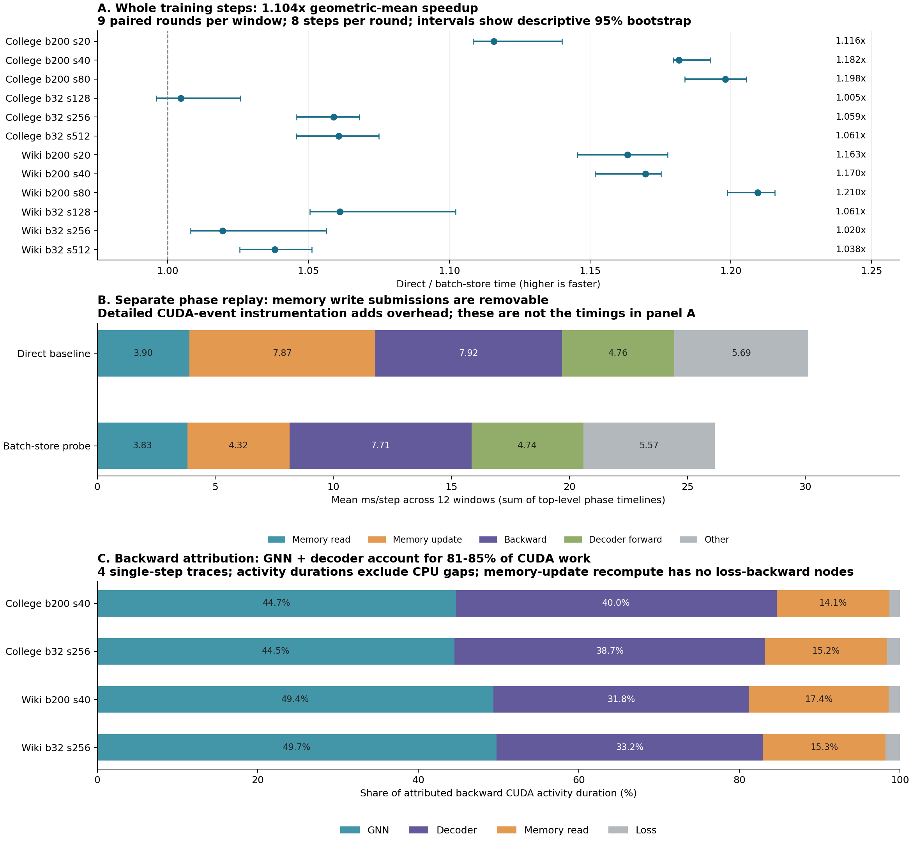

当前 direct-CSR 路径的首要可消除开销，是消息缓存中逐节点的小 GPU 索引和提交。已用批量写入探针验证：同一 GPU3 会话、12 个窗口、九轮配对计时，整步加速比的几何平均为 **1.104×，时间减少 9.46%**。96 步的训练状态、逻辑消息缓存和随机数状态全部逐字节一致。反向传播的主要 GPU 工作来自 GNN 和 Decoder；不能把整个 Backward 归给 Memory。

测量基线是上一阶段通过 source 数值资格的 direct-CSR 实现。模型仍为 FP32，保留原来正负样本的前向／反向组织、14 次 torch_sparse SpMM、整数关系生成及真实训练更新。所有比较使用本次同一 GPU3 会话，不与前几次实验拼接绝对耗时。

下表来自**单独插桩回放**，每个窗口八步，先求各窗口每步均值，再对 12 个窗口等权平均。占比分母是最外层阶段时间之和；CUDA event 时间包含 CPU 提交间隙。详细插桩有额外开销，表中的毫秒数和占比用于定位，整步收益以图 A 的无详细插桩配对计时为准。

| 阶段 | direct，ms/步 | 占比 | 批量写入后，ms/步 |
|---|---:|---:|---:|
| Memory 读取／生成当前 embedding 的状态 | 3.901 | 12.9% | 3.828 |
| Memory 状态更新与消息缓存写入 | 7.871 | 26.1% | 4.315 |
| Backward | 7.915 | 26.3% | 7.714 |
| Decoder 前向 | 4.756 | 15.8% | 4.735 |
| GNN 前向 | 1.952 | 6.5% | 1.877 |
| 采样、邻居写入、Adam 等其余阶段 | 3.737 | 12.4% | 3.692 |

Memory 读写合计约 **39.1%**，与 Backward 合计约 **65.3%**。这是在新 direct 基线上重新测出的结果。Memory 内部继续拆解如下，源／目的方向以及读取／状态更新两次调用的同类叶子阶段已相加；不再把父阶段相加，避免重复计数。

| Memory 内部工作 | direct，ms/步 | 含义 |
|---|---:|---|
| 逐节点消息缓存写入 | 4.247 | Python 循环内分别索引 src、dst、t、raw_msg；含元数据读取和循环 |
| 消息拼接 | 1.595 | 从字典取到的许多小 Tensor 做 cat |
| Last-message 聚合 | 0.942 | 时间戳选择、索引和相关检查 |
| 时间编码 | 0.904 | 时间差、类型转换、线性变换与 cos |
| GRU | 0.579 | 两次 Memory 重算中的 GRU 前向总和 |
| 字典查找 | 0.329 | 节点 ID 转主机列表、查 Python 字典 |
| 消息组合 | 0.289 | 读取节点 memory 并拼接消息特征 |
| 状态写回 | 0.285 | memory 与 last_update 写回 |

**已经验证的改动**位于 [instrument.py](src/instrument.py) 的 `install_batch_store`：保持原 sort、unique 和节点内消息顺序，把排序后的四个字段各 gather 一次，再按原计数 split 成视图并写回字典。两个方向合计每步八次 gather。

四个中间窗口的单步 trace 中，缓存写入的 `aten::index` 次数由 **128 / 600 / 152 / 524** 降到各 **8** 次，依次对应 Wikipedia B32 / B200、College B32 / B200。Wikipedia B200 的整步 CUDA kernel 数从 **1613 降到 1021**，减少的 592 个正好对应缓存 gather 的减少。该例原来 600 个 gather 的 GPU 执行时间合计不到 1 ms，而提交这些操作的阶段明显更长；整步配对实验也确认减少小操作有效。这支持优先优化消息写入的 CPU 循环／GPU 提交碎片，而不是优先加速 GRU 矩阵乘。

无详细插桩计时包含正常的内存分配、主机同步、图与关系生成、前向、反向、Adam 和真实状态更新；checkpoint 恢复、GC 和预热在计时区外。每个窗口九轮随机配对，每轮连续八步，共 **216 个区间、1728 个计时训练步骤**。

| 范围 | 配对加速比几何平均 | 各窗口配对中位数范围 |
|---|---:|---:|
| 全部 12 窗口 | 1.104× | 1.005–1.210× |
| B32，六个窗口 | 1.040× | 1.005–1.061× |
| B200，六个窗口 | 1.173× | 1.116–1.210× |

11/12 个窗口的描述性 bootstrap 95% 区间下界大于 1；College B32 step128 为 **[0.996, 1.026]**，不能声称该窗口有稳定收益。区间基于本次单会话的九个配对比值，不代表跨机器／跨会话保证。完整绝对时间和区间见 [12 窗口表](analysis/table.md)。

**Backward 的归属**通过四个中间窗口、两种实现各一步的 CPU/CUDA trace 确认。按照[PyTorch profiler 的前后向序号关联说明](https://docs.pytorch.org/docs/stable/autograd.html#torch.autograd.profiler.emit_nvtx)，用 backward 的 sequence number 与 forward thread 找前向来源；序号在未产生反向节点的操作间会复用，所以每条 trace 最初出现的六处跨 scope 歧义进一步用 Chrome `fwdbwd` 流确认，不凭操作名称硬分配。实际运行版本为 PyTorch 2.11.0+cu130，具体解析以该版本的本地源码和原始 trace 为依据。

每条 trace 有 112 个 autograd engine 节点，其中 93 个关联到前向来源，另 19 个无序号的叶子／AccumulateGrad 节点单列；没有剩余的序号歧义。以下是 direct 基线的 **Backward GPU activity 时长构成**，不是整步墙钟占比：

| 单步窗口 | GNN | Decoder | Memory 读取 | Loss |
|---|---:|---:|---:|---:|
| Wikipedia B32 step256 | 49.7% | 33.2% | 15.3% | 1.8% |
| Wikipedia B200 step40 | 49.4% | 31.8% | 17.4% | 1.4% |
| College B32 step256 | 44.5% | 38.7% | 15.2% | 1.6% |
| College B200 step40 | 44.7% | 40.0% | 14.1% | 1.3% |

GNN + Decoder 合计 **81%–85%**。这些单步反向包含约 247–279 个 CUDA kernel，其实际活动时长合计约 **0.49–0.73 ms**；带 profiler 的反向 CPU 阶段为 9.6–13.4 ms，包含框架、提交、等待和 profiler 开销。Wikipedia B32 的 loss engine 还出现一次明显的 CPU 耗时异常，因此不使用这四个单样本的 CPU 百分比作为生产占比。GNN 的梯度索引写入、矩阵乘和归约，以及 Decoder 的梯度索引、MLP 和 14 个 SpMM 反向，是后续应具体检查的工作。

Memory 有两次重算：读取 embedding 所需状态，以及 `update_state` 中的状态推进。后者的输出没有连到当前 loss，且该步结束会 detach；八条 trace 中均**没有归属于 memory_update 的 loss 反向节点**。它仍支付约 2.736 ms/步的前向重算阶段时间（详细插桩口径）。因此，“去掉这部分不必要的 autograd 建图”是下一个可检验候选，但本次没有实现或计入收益，未来仍需独立的完整状态资格检查。

归因覆盖也保留了边界：FunctionEvent 会省略部分重复嵌套 CPU 事件，因此以唯一对象 UID 构建父子树，并用完整 Chrome CPU 树补齐；两个树在共同事件上的 owner 全部一致。每条 trace 的 GPU activity 关联覆盖率为 **98.2%–99.3%**。未关联的 8 或 20 个活动是缺少 External ID 的本地 graph-builder／integer-producer kernel，逐项保留在结果中，没有强塞进 Backward。GPU activity 汇总仅包含 kernel、memcpy、memset，排除了 GPU annotation，避免重复计时。trace 中活动区间并集只覆盖整步区间约 6%–9%，但 profiler 显著拉长了间隙，这**不等于生产 GPU 利用率或硬件 occupancy**。

批量缓存的正确性门槛比上一阶段更完整：对每个窗口连续八步检查，共 **96/96** 步与 direct 基线的 **119 个字段逐字节一致**，覆盖原 107 个参数／梯度／Adam／memory／邻居／输出字段，加上两个方向逻辑打包的消息缓存及 CPU/CUDA RNG。独立 CPU/NumPy 审核比较了 **214,887,202 个元素**；direct 和候选各自的原 107 字段也都 96/96 与归档 source 一致。详细 event replay 的 24 个末状态和八个 trace 的末状态另以 115 个可持久化字段逐字节复核；trace 使用 `check=False`，没有为检查 embedding 梯度而增加 retain-grad 节点。见 [独立审核](evidence/qualify_v1/audit.json)。

共享视图有占用代价：本次 96 个观察点里，去重后的消息缓存底层 Tensor storage 最大为逻辑缓存的 **2.114×**，绝对最大为 **4,842,312 字节（4.84 MB）**；原实现的 storage 字节数等于逻辑字节数。这统计的是底层 Tensor storage，不包含 Python 对象、CUDA allocator 取整或保留区。八步窗口不能证明长训练的占用上界，因此该实现应作为已通过局部资格的优化候选，正式长跑前需检查存储增长或增加合适的回收策略。

后续优先顺序据此明确：先处理批量缓存的长期存储行为并巩固本次收益；再检验状态推进中无用的 autograd 建图；随后围绕 Decoder/GNN 的反向提交和索引操作做保持浮点顺序的优化。消息读取的 cat 仍是 Memory 内第二大项。当前证据尚不能把剩余开销算成 Tensor Core 可加速空间。

实验保留了相同的 12 个冻结历史 checkpoint，历史来自之前的 keeper 路径，因此结论是这些窗口上的条件一致性和性能诊断。没有全 epoch、下游质量、原版 TGN 完整入口或 Tensor Core 收益结论。源码、原始 trace、逐窗口时间、存储观察及复现命令见 [REPRODUCE.md](REPRODUCE.md)；大张量归档保留在远端新实验目录，原项目和此前证据未修改。
