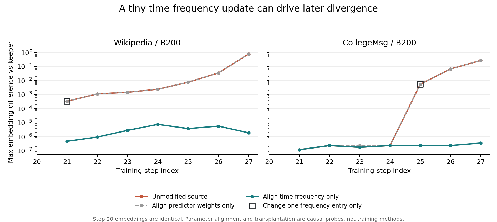

**已定位两个失败窗口的误差放大机制，并得到通过全部 12 个窗口的原版兼容路径。** 保留整数系数生产器，恢复原版七通道稀疏聚合及正负查询的计算组织后，96 个训练步的所有已检查字段与归档原版结果完全相同。CPU/NumPy 独立核对了 187,803,430 个张量元素；这是重复字段的比较量，不是独立用例数量。这里的 96 步来自 12 个各连续八步的窗口，均从相同的真实训练 checkpoint 出发。

通俗地说，最开始只是加法次序不同带来的一点舍入差异；它传进了一个“对细微变化非常敏感的时钟”，又随着记忆状态和权重更新逐步放大。这次通过只改一个权重的对照实验，确认了这个放大环节，并做出了保持原版轨迹的兼容实现。

**最早的差异发生在浮点消费阶段。** 本轮重放了 Wikipedia 和 CollegeMsg、B200、步骤 20–27 的两个失败窗口；原有失败被原样复现。另在每个窗口的第 20、27 步，固定真实 embedding、查询和解码器权重，比较原版、keeper 与 FP64 稠密参考。四个状态的整数 C 均逐项相等。

| 固定真实输入的状态 | 原版与 keeper 聚合输出最大差异 | dX 最大差异 | 使用相同上游梯度时 dX 最大差异 |
|---|---:|---:|---:|
| Wikipedia，20 | 4.77e-7 | 6.98e-10 | 4.66e-10 |
| Wikipedia，27 | 1.91e-6 | 1.40e-9 | 9.31e-10 |
| CollegeMsg，20 | 3.81e-6 | 9.31e-10 | 9.31e-10 |
| CollegeMsg，27 | 5.72e-6 | 9.31e-10 | 4.07e-10 |

这些单次差异均通过原有 `atol=rtol=2e-4` 的门槛。使用同一个上游梯度仍有差异，说明反向求和方式本身也会引入舍入差异。原版使用逐通道的 `torch_sparse.spmm_add` 和分开的正负查询计算图；keeper 使用分块合并的 PyTorch CSR SpMM，端点乘积也合并计算。本轮兼容修复同时恢复这两处组织方式，尚未把各自对最终漂移的贡献完全分离。

FP64 稠密参考使用相同 FP32 输入和参数的精确升精度版本。独立 NumPy 实现另外复算了聚合、两层 MLP、BCE、参数梯度、dX 和公共上游梯度的反向乘法，与归档 FP64 结果最大差异为 8.89e-15。在这四个状态的公共梯度反向对照中，keeper 相对高精度参考的 RMS 误差均比原版更小。因此，轨迹偏离原版不能直接解释为数学公式错误或预测质量更差。

**时间编码是已证实的放大环节。** 源码计算 `cos(时间差 × 频率权重 + 偏置)`，频率权重参与训练，并被 memory 与 GNN 共享。以下干预都恢复相同 checkpoint 和随机状态，保持其他初始模型状态不变。

| 干预 | Wikipedia | CollegeMsg |
|---|---:|---:|
| 首次不同的频率更新发生在 | 步骤 20 | 步骤 24 |
| 100 个频率项中不同的项数 | 1 | 1 |
| 该项权重差异 | 2.98e-8 | 5.96e-8 |
| 下一步观测到的最大时间差 | 106,933 | 1,340,971 |
| 只移植该权重，时间编码最大变化 | 0.003906 | 0.124366 |
| 只移植该权重，下一步 embedding 最大变化 | 0.000336945 | 0.005490154 |
| 原版正常回放，通过步数 | 1/8 | 5/8 |
| 每步只对齐频率权重，通过步数 | 8/8 | 8/8 |
| 每步只对齐解码器权重，通过步数 | 1/8 | 5/8 |

单个频率项的移植已经足以重现原失败轨迹下一步 embedding 的最大偏差。只对齐频率后，窗口末步的 embedding 最大差异从 Wikipedia 的 0.77768、CollegeMsg 的 0.27222，分别降到 1.91e-6 和 3.58e-7。时间差乘频率的理论相位变化与 FP32 仿射运算的量化共同影响实际编码；例如 CollegeMsg 中理论相位变化最大约 0.07993，而编码差可达 0.12437。

权重对齐和移植依赖另一条轨迹，只是因果诊断，不能作为实际训练方案。这些干预证明了此处频率变化足以触发漂移，也提供了在这两个窗口内抑制漂移的证据；它们没有证明所有时序模型都存在同样程度的问题。

**通过验收的修复保留了原模型精度。** 实现位于 [diagnose.py](src/diagnose.py) 的 `install_compatible`：原有普通 GPU builder 和整数 C 生产器保持使用，正负查询共享建图；各自生成系数后，重建七个原版稀疏消费者，沿用原版 decoder 的前向及自动求导计算图。当前实现通过稠密 C 中间转换来恢复格式，实际成本需要计入性能分母。

| 候选 | 对照与覆盖 | 结果 |
|---|---|---|
| 原版消费方式兼容路径，FP32 | 全部 12 个窗口，对归档原版 FP32 | 96/96 步通过，已检查字段逐元素完全相同 |
| 时间编码参数、Adam 状态及 affine/cos 改为 FP64，输出转回 FP32 | 两个失败窗口，比较两条同样升精度的路径 | Wikipedia 5/8，CollegeMsg 2/8；共 7/16，通过门槛不足 |

兼容路径已检查参数、梯度、Adam 状态、memory、last_update、有效邻居、embedding、dX、logits 与 loss。每步对照没有另行逐字段比较消息字典和随机数状态；它们在起始 checkpoint 中恢复，随后参与真实连续训练。严格的一致性结论限于已检查字段与本次冻结窗口。

FP64 候选仍有 9 步失败，因此停在预先规定的见证窗口门槛，没有扩大成成功结论，也没有放宽阈值。它改变了模型的数值精度，不能冒充原版 FP32 轨迹的修复。

**通过一致性验收需要支付的成本也已测量。** 在同一训练框架内，每个窗口进行九轮随机顺序的配对计时，每轮恢复相同 checkpoint 并执行八个完整训练步，共 432 段、3,456 个计时步骤。四条路径均在计时外恢复状态并执行垃圾回收，计时内覆盖真实 memory、GNN、解码器、反向和 Adam。

| 配对时间比值 | 12 个窗口的中位比值范围 | 窗口比值的几何平均 |
|---|---:|---:|
| 原版解码器路径 / 兼容路径 | 1.833–2.533× | 2.138× |
| 旧 keeper / 兼容路径 | 0.777–0.903× | 0.843× |
| 兼容路径 / 免费建图、关系及格式恢复 | 1.186–1.319× | 1.229× |

比值为分子耗时除以分母耗时。兼容路径对本框架的原版解码器路径已有普通实现收益；相较旧 keeper，其开销增加约 10.7%–28.6%，按几何平均约为 18.7%。旧 keeper 在两个窗口未通过原版轨迹门槛，所以不能把它直接称为已合格的完整训练基线。这里的“原版”指本训练框架中的作者解码器实现，未运行作者完整数据集入口。

免费关系对照保留原版浮点聚合、反向和全部训练更新，只缓存每步的七通道稀疏系数。该对照也在 96/96 步上与归档原版逐元素完全相同。它免掉了建图、整数生成和当前稠密格式恢复，因此 1.186–1.319× 包含兼容实现的额外转换开销，不能全部算作 Q/S 的计算空间，也不能归给 Tensor Core。降低这一部分普通实现开销应先于新内核开发。

这组数字与前一轮 keeper 的免费关系上限 1.015–1.063× 使用不同实现和不同计时场次，不能直接混算。新的兼容基线更慢，可移除工作也包含更多格式转换。完整窗口耗时、九个配对样本和本场次的描述性 bootstrap 区间见 [计时表](analysis/timing_table.md)与[计时原始汇总](analysis/timing_summary.json)。这些结果没有跨时段、跨硬件的泛化保证。

**这轮工作的边界。** 一致性诊断与兼容路径已经完成；旧 keeper 的两个失败窗口仍保留在原始证据中。当前结果没有覆盖完整 epoch、验证集质量、原版 TGN 入口，或新的 GPU 架构。所用训练 checkpoint 的历史前缀由此前 keeper 生成，本轮验证的是从这些相同起点出发与原版的条件等价性。

后续性能工作应以这个通过门槛的路径作为数值参照，先降低其格式恢复成本，再细分 memory 与反向阶段。此前 memory 与整模型反向约占旧 keeper 的 65%–71%，这是继续定位的依据；对新兼容路径仍需重新归因。本轮没有加入新 Tensor Core kernel，也没有把因果诊断当作模型质量或论文加速结论。

实验使用此前冻结的 TNCN、两份 20k 事件前缀、B32/B200、D100、mode 2、两跳邻居、真实 memory/GNN、全模型 Adam；保留确定性设置和原验收阈值。硬件为 RTX PRO 6000 Blackwell，GPU2 通过既有互斥锁及空闲检查后使用。复现步骤与证据位置见 [REPRODUCE.md](REPRODUCE.md)，原始数值核对见 [audit.json](evidence/audit.json)，全部窗口比较见 [qualify_v1](evidence/qualify_v1/stdout.jsonl)。

收尾核验：40 份原始张量归档共 2,448,209,188 字节保留在远端；34 份非张量证据已下载或与本地源文件逐项核对，哈希全部相符。此前归档及运行时源码的 1,202 个文件全部保持原哈希。最终库存确认 GPU2 空闲，实验进程及互斥锁已释放。见 [远端清单](remote_manifest.json)与[传输核验](transfer_verification.json)。
