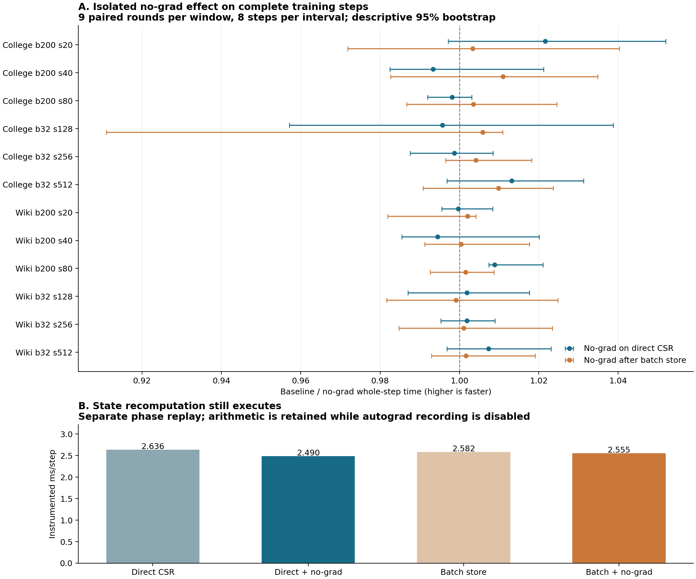

**状态推进中关闭自动求导，数值上成立，但没有成为有效的整步性能优化。** 本次四种路径各自通过 96 步、119 字段逐字节检查；单独加入 no-grad 的整步配对加速比几何平均仅 **1.0029×**，叠加到批量消息缓存后为 **1.0036×**。大多数窗口的置信区间包含 1，应把它保留为已验证的小改动，而不继续把它当作主要提速方向。

改动在 [candidate.py](src/candidate.py) 的 `install_nograd`：只在 `TGNMemory._update_memory` 外包一层 `torch.no_grad()`，内部仍调用原来的完整方法。消息生成、LastAggregator、GRU、时间戳计算和状态写回都执行；用于当前预测的 Memory 读取、GNN、Decoder 和 loss 反向均保留自动求导。没有跳过重算，没有使用 inference_mode，也没有 detach 参数或改变浮点精度。

同一 GPU3 会话比较四种固定实现：direct CSR、direct＋no-grad、批量缓存、批量缓存＋no-grad。每窗口九轮随机配对，每轮连续八步，共 **432 个计时区间、3456 个完整训练步骤**。checkpoint／RNG 恢复、GC 和预热在计时区外。原有浮点运算组织、14 次 SpMM 和真实训练状态更新仍全部付费。

| 比较 | 整步加速比几何平均 | 耗时变化 | 12 窗口中 95% CI 下界 > 1 |
|---|---:|---:|---:|
| direct → direct＋no-grad | 1.0029× | −0.286% | 1/12 |
| 批量缓存 → 批量缓存＋no-grad | 1.0036× | −0.361% | 0/12 |
| direct → 批量缓存 | 1.1129× | −10.14% | 12/12 |
| direct → 批量缓存＋no-grad | 1.1167× | −10.45% | 11/12 |

前两行隔离 no-grad 的贡献，后两行显示组合效果仍主要来自批量缓存。**不能把 1.1167× 算成关闭建图的收益**。这里的组合结果来自本次同卡配对，不是相乘前几轮实验的比值；不同配对中位数也不要求代数上完全可传递。

no-grad 单独的窗口中位数范围为 **0.9933–1.0216×**；已有批量缓存时范围为 **0.9991–1.0109×**。唯一单独比较区间完全高于 1 的窗口是 Wikipedia B200 step80，区间约 **[1.0074, 1.0210]**。没有根据单个窗口选择运行分支。所有区间是本次九个配对比值的 20,000 次 bootstrap 描述性区间，不代表跨会话保证，也不证明真正的收益严格为零。完整结果见 [绝对时间表](analysis/table.md) 和 [no-grad 区间表](analysis/intervals.md)。

额外的机制检查确认 no-grad 确实生效。对四个中间窗口首步、四种实现，共 **16 个诊断步骤**，在 `_update_memory` 返回后立即观察状态 Tensor：

| 观察项 | 原状态推进 | no-grad 状态推进 |
|---|---|---|
| 外层自动求导模式 | 开启 | 开启 |
| `memory.requires_grad` | True | False |
| `memory.grad_fn` | IndexPutBackward0 | None |
| 从状态 Tensor 可达的 autograd 节点 | 23 | 0 |

23 是可达图节点数，含 17 个非叶节点和六个参数梯度叶节点；它不是“每步新分配 23 个节点”或显存节省量。预测路径仍会对参数求梯度，完整梯度／Adam 逐字节检查也验证了这一点。观察器不使用 hooks，只在独立诊断步骤读取属性并遍历 `next_functions`，没有进入性能计时。

详细 CUDA-event 回放同样表明，**状态重算的主要工作仍在**：direct 的重算阶段约 2.636 ms/步，no-grad 为 2.490；批量缓存路径约 2.582，叠加 no-grad 为 2.555。它们来自单独插桩的八步回放，包含 CPU 提交间隙和插桩开销，不能把这些局部差值直接换算为生产整步收益。上一轮已经确认状态推进的这张图没有参与当前 loss 的反向，因此本轮移除的是建图／保留图的开销，并没有省掉一次实际执行的 GRU 反向。

正确性门槛没有放宽。四种实现各自 **96/96** 步与上一轮 direct 基线的 119 字段逐字节一致，每种比较 **214,887,202 个元素**；原有 107 字段也各自 96/96 与 source 归档一致。119 字段包括参数、梯度、Adam、memory／last_update、有效邻居、输出／loss／embedding／dx、两个方向的逻辑消息缓存及 CPU/CUDA RNG。独立 CPU/NumPy 审核在 CUDA 隐藏的进程中重读原始张量、检查 dtype 与实际字节，并在计时前完成。见 [独立审核](evidence/qualify_v1/audit.json)。

另有 **48 个详细回放末状态**通过 115 个持久状态字段的逐字节检查，**16 个机制诊断步骤**通过完整 119 字段检查。全部原始数值结果和计时均保留；没有失败后放宽精度或挑选窗口。

no-grad 前后，消息缓存逻辑字节、底层 storage 字节和存储数量在全部 **192 个配对观察点**上一致。它继承批量缓存的视图存储行为，没有解决上一轮暴露的长期保留问题。这里只是相同历史 checkpoint 出发的八步窗口，仍不能宣称全 epoch 精度或长训练占用有界。

因此，本轮不把 no-grad 提升为新的主要性能基线，也不继续围绕这点做复杂优化；代码作为已通过局部数值资格的可选实现保留。下一项更值得投入的是消息缓存的长期存储布局与批量读取，减少剩余的字典／小 Tensor 拼接成本，同时处理共享批次存储的保留。后续任何读取顺序或聚合改动仍须保持已建立的 source 数值资格。

原项目、上一轮实现和此前证据均保持不变。完整脚本、运行环境、命令及产物说明见 [REPRODUCE.md](REPRODUCE.md)。本轮没有全 epoch、下游质量、原版 TGN 完整入口或 Tensor Core 收益结论。
