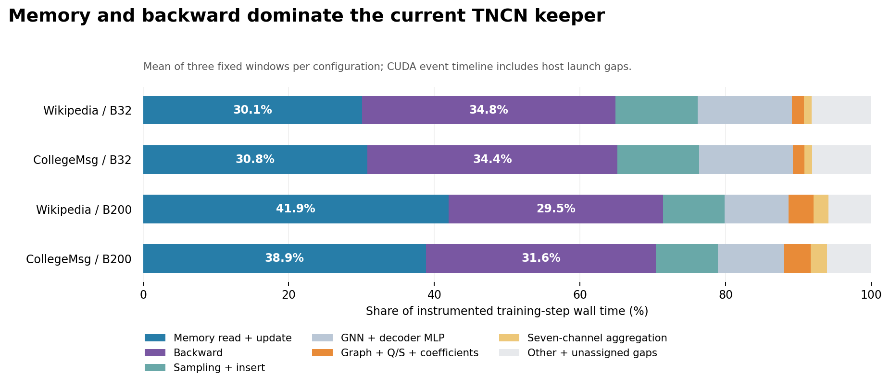

# 真实训练测量结果

**本轮不支持继续把 Q/S 或消费者列布局作为完整训练 1.10× 的主加速机制。** 在当前普通 GPU keeper 实现上，连同建图一起免掉全部关系生成，复核后的整步加速中位数也只有 **1.015–1.063×**；12 个窗口比值的几何平均为 **1.038×**。下一步应先处理完整训练的一致性，再检查 memory 路径。

这些是新执行的 TNCN 训练窗口测量：嵌入来自实时更新的 memory 和 GraphAttentionEmbedding，反向传播覆盖整个模型，Adam 更新所有被使用的参数。它们仍属于固定配置、固定数据前缀的诊断，不能代替完整数据集训练质量或原始 TGN 的验收。

| 数据与 batch | keeper 整步耗时 | 免费建图及全部关系后的整步比值 |
|---|---:|---:|
| Wikipedia，32 | 14.55–15.18 ms | 1.019–1.026× |
| Wikipedia，200 | 23.50–25.05 ms | 1.039–1.063× |
| CollegeMsg，32 | 15.92–16.89 ms | 1.015–1.035× |
| CollegeMsg，200 | 21.31–24.28 ms | 1.035–1.063× |

每行覆盖三个预先固定的窗口，每个窗口连续八步。数值来自第二次计时：每个窗口九轮随机顺序的配对对照，共 324 段、2,592 个计时训练步。比值为配对比值的中位数；“免费”对照只是复用该步已核对的图或整数 C，保留采样、memory、聚合、反向及 Adam 的实际执行，不是可部署的加速实现。

第一次三轮计时得到 1.029–1.070×，但存在单次 1.551× 的异常波动，已完整保留。第二次在每次恢复 checkpoint 后、计时前执行 Python 垃圾回收；训练计时期间 GC 仍开启。两次计时分别报告，没有筛掉慢样本后合并。第二次九轮配对中位数的描述性 bootstrap 95% 区间，上端最大为 1.086；这仅描述本次共享主机内的样本波动，不是跨机器或跨时段保证。详见[第一次数据](analysis/table.md)、[九轮复核](analysis/recheck_table.md)及[原始比值与区间](analysis/recheck_summary.json)。

**时间主要花在 memory 和反向。** 下表是第一次独立插桩回放中，四种配置各三个窗口的平均占比范围；CUDA event 时间线包含 CPU 提交间隙，不能当作纯 GPU kernel 活跃时间。插桩总耗时相对同轮普通计时约为 0.998–1.092 倍，因此收益判断以上面的完整步配对计时为主。

| 阶段 | 时间线占比 | 当前可支持的判断 |
|---|---:|---|
| Memory 读取与更新 | 30.1%–41.9% | 最大的普通实现优化候选之一 |
| 整个模型的反向传播 | 29.5%–34.8% | 需要进一步分开 memory、GNN 与解码器反向，不能全部归给 SpMM |
| 负采样、邻居读取与插入 | 8.4%–11.3% | 包含真实源采样器的执行 |
| 建图 | 0.45%–0.68% | 已有普通 GPU builder，继续优化的整步空间很小 |
| Q、带权 S、七通道系数生成 | 0.98%–3.15% | 包含计数、精确分配、同步及写出两遍 |
| 七通道特征聚合 | 1.04%–2.26% | 当前使用 PyTorch CSR SpMM，聚合反向记入整模型反向 |

按免费对照反推，建图与全部关系生成合计可消除的整步时间约为 **1.51%–5.97%**。完整 1.10× 至少需要消除 9.09%；即使把上述阶段整体加速两倍，按这个分母推算也最多约 **1.031×**。这支持停止本轮复杂关系内核的开发，不构成对更大图、更深采样或 memory 已充分优化后的模型的普遍否定。

**带权 S 已实际计费。** Wikipedia 的这些查询来自二部图，S 全为零；CollegeMsg 的 S 每步平均非零数约为 78–1,326，实际最大权重为 62。不能用布尔支持代替这些权重。现有 keeper 在每个查询 block 内生成 Q 与 S，再生成七通道整数 C；“统计 nnz”和“写出 C”两遍都会重新计算它们，这是确认存在的重复工作。此次完整步计时已经包含两遍成本。

keeper 已避开作者路径的全图 A²、A³ 和多次稠密系数转换，且正负查询共享图。B200 使用不超过 64 个查询的分块来组合已验证的原生 producer。原生 Q/S 在同一 kernel 内，没有把整核耗时伪拆成独立的 Q、S 时间。作者路径的插桩另记录了 A²、A³、带权 S、掩码系数和七次聚合，可在 [phases.csv](analysis/phases.csv) 查看；那些细分时间不能直接当作 keeper 中同名数学操作的成本。

**完整训练数值验收仍有两个失败窗口。**

- 96 个真实输入状态的整数七通道 C，全部与原生 `torch_sparse` 作者实现精确一致，覆盖 96,153,792 个系数位置。
- Keeper 自身回放、免费建图、免费全部关系，各 96 个训练步均通过 `atol=rtol=2e-4` 的状态比较，包括 embedding、dX、所有参数梯度、Adam、memory 和采样缓存。
- 作者路径对 keeper 为 **86/96 步通过**；Wikipedia B200 与 CollegeMsg B200 的首个窗口共 10 步失败。按完整窗口计为 **10/12 通过**。没有改变容差，也没有用第二次计时替换失败记录。
- 独立 CPU/NumPy 审计重现了全部 384 个比较的通过/失败标记，复核约 7.51 亿个张量元素比较。这些字段与元素比较不是相互独立的训练试验。[审计结果](remote_evidence/output/full_v5/raw_audit.json)

Wikipedia 失败窗口第一步的 embedding 与 memory 完全相同，更新后的时间编码权重最大差异仅约 2.98e-8；到第八步，embedding 最大差异扩大到约 0.778，logits 到约 0.0763。CollegeMsg 第八步对应约为 0.272 与 0.0272。证据符合微小 FP32 差异经可训练时间编码和递归状态放大的现象，但本轮没有隔离到唯一算子，也没有证明最终任务质量下降。整数关系正确和短步解码器测试通过，都不足以替代这一层验收。

此前默认非确定性执行还出现了同一 keeper 回放得到不同邻居事件缓存的问题。已保留 smoke_v4 失败；之后所有训练历史和对照统一开启 PyTorch 确定性算法，并重跑完整检查。源 `LastNeighborLoader.insert` 的重复索引写入是这一现象的源码线索；PyTorch 文档说明确定性模式会改变此类索引写入的算法。[PyTorch 2.11 文档](https://docs.pytorch.org/docs/2.11/generated/torch.use_deterministic_algorithms.html) 本报告的性能分母包含这一设置，不声称代表默认非确定性模式的吞吐量。

| 本轮入口 | 与最终原始 TGN 验收的差异 |
|---|---|
| 固定 TNCN 快照，mode 2、两跳采样、七通道解码器 | 没有运行原始 TGN 的模型入口；TNCN 结果不能转记成 TGN 结果 |
| JODIE Wikipedia / CollegeMsg 各 20,000 事件前缀 | 没有运行官方完整 TGB 数据划分、验证负样本或测试集 |
| D=100、k=10、B32/B200、无 CN 衰减 | 更大邻居数、维度、图和时间衰减需要新的测量 |
| PyTorch 2.11 / CUDA 13.0 / PyG 2.7 / torch_sparse 0.6.18 | 与作者早期依赖版本不同；实际快照和依赖均有哈希/版本记录 |
| 真实连续训练历史与 96 个选定训练步 | 未做完整 epoch、验证集指标、收敛质量或多随机种子训练 |
| RTX PRO 6000 Blackwell，GPU2 独占、主机共享 | 备用 A800 仍连接超时；没有新增原生 BMMA 实测 |

建议按顺序推进：先建立两处失败窗口的单步高精度参考，定位时间编码权重更新差异的来源；再针对 memory 的消息缓存、逐节点张量操作和重复更新检查普通实现优化空间；通过完整状态验收后，回到原始 TGN 入口重测。当前无需继续投入消费者列布局或新的 Q/S Tensor Core 内核。

运行定义见 [CONTRACT.md](CONTRACT.md)、[确定性设置修订](AMENDMENT_01.md)、[计时复核修订](AMENDMENT_02.md)。[复现与数据索引](REPRODUCE.md)列出全部执行命令、原始张量位置和失败尝试。GPU2 已释放。
